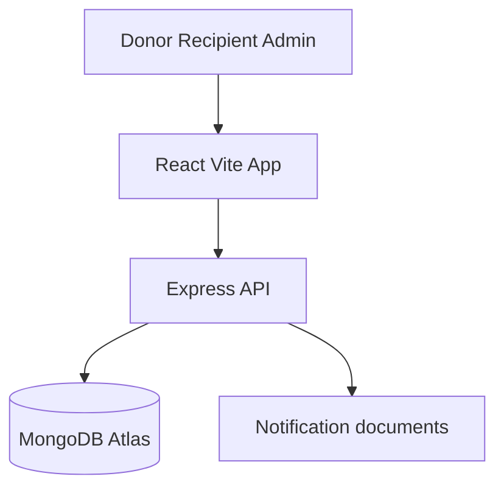
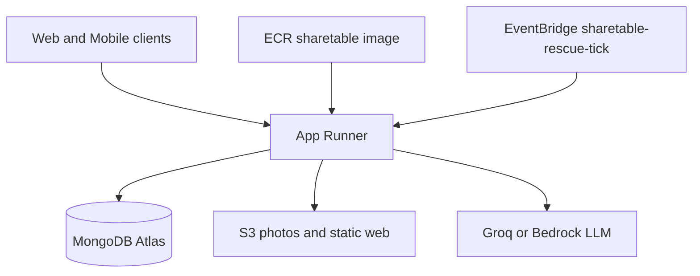

# ShareTable

Don't waste food. Rescue it.

ShareTable connects people and businesses with surplus food to registered recipients nearby (NGOs, community groups, and individual community members). Matching starts at about **2.5 km**, and each listing has a **1-hour** claim window.

This is a working product demo, not a chatbot-only experiment and not a food-waste blog. Donors type how much food they have. The app matches on registration and distance. It never ranks people by need.

**Public repo:** [github.com/the-ivii/ShareTable](https://github.com/the-ivii/ShareTable)

## Live demo

- App and API: [https://vmcwfgh43e.ap-south-1.awsapprunner.com](https://vmcwfgh43e.ap-south-1.awsapprunner.com)
- Health: [https://vmcwfgh43e.ap-south-1.awsapprunner.com/api/health](https://vmcwfgh43e.ap-south-1.awsapprunner.com/api/health) (reports `runtime`, `region`, and `llm`)
- Youtube Demo Link: https://youtu.be/eZ2PY4_q9ak?si=aZeuqriXBXJeQNIk

The live service runs on **AWS App Runner** in `ap-south-1` (Express API + Vite SPA in one container), with **MongoDB Atlas** for data, **ECR** for the container image, **S3** for photos and a static web copy, and **EventBridge** rule `sharetable-rescue-tick` (every 1 minute) calling `/api/internal/rescue-tick`. CloudFront is optional and may stay off until AWS account verification finishes. Use the App Runner HTTPS URL for demos.

Try the seeded accounts under [Demo credentials](#demo-credentials).

## Problem

College messes, restaurants, events, and households often have leftover food that is still usable. It gets thrown away because there is no fast way to tell nearby registered recipients it is available.

## Solution

**DONATE → MATCH (2.5 km) → NOTIFY → CLAIM (atomic) → PICKUP CODE → PICKED UP → IMPACT**

Only meals marked **PICKED_UP** count as rescued. Unclaimed meals after expiry do not.

## What you can do today

### Core rescue flow

- Email and password auth with JWT, plus donor, recipient, and admin roles
- Email verification over SMTP before first login (Gmail App Password supported)
- Donor posts surplus meals with quantity, **required storage condition**, allergens, prepared / best-before times, and optional pickup instructions
- Geospatial matching on MongoDB Atlas (`2dsphere` / `$geoNear`) at `DEFAULT_RADIUS_KM=2.5`
- Atomic claims that never drive `availableQuantity` negative
- Clear concurrent-claim message when someone else takes meals first
- One-hour server-side expiry (the countdown on screen is informational)
- Pickup codes like `ST-1234`
- Donor, recipient, and admin impact dashboards
- Dark theme by default, with a light/dark toggle

### Maps and places

- Leaflet maps with Esri street tiles
- Location picker with GPS, named area search (`/api/places`), and pins that sit correctly under the sticky nav
- Recipients see distance until they claim; exact pickup details unlock after a claim
- Admin heatmap snaps live markers to a ~200 m grid for privacy

### Donate experience

- Multi-step donate wizard (essentials → safety → pickup)
- **Improve description with AI** (Groq `openai/gpt-oss-20b` by default; Amazon Bedrock Nova Micro when `LLM_PROVIDER=bedrock`)
- Common allergen checklist plus custom allergens
- Custom datetime picker with 12-hour AM/PM and validation for prepared / best-before
- Optional meal photos via `POST /api/uploads/photo-url` (presigned S3 PUT); the PhotoPicker component exists, and `imageUrl` is shown when present

### Claims and live status

- Claim button shows a loader while the request is in flight
- Donation and claim detail pages refresh about every **8 seconds**
- In-app notifications poll about every **8 seconds**

### ShareTable Assistant

A floating assistant for donors and recipients (hidden for admins). It explains pickup rules, checks an open pickup, and proposes updates. Nothing is sent until you confirm.

Supported update types:

- **Late** (running behind or a clock-time ETA)
- **Pickup instructions** (for example food kept with the guard)
- **Arrived** (pure arrival at the door or location)
- **Relay** (short notes either way, such as “please come to the gate”)

Confirm with the **Confirm** button, or by typing `send it`, `send the notification`, `yes`, or `confirm`. Cancel with the button or `cancel` / `never mind`.

“I have reached the location, please come to the gate” creates a pending relay; follow-up `send it` sends it. Soft donor asks without guard/keep content stay RELAY, not invented instruction updates. Pickup codes are stripped from outbound assistant messages where required.

Pending proposals are **process-local in memory** (lost on App Runner restart). Intelligence elsewhere stays deterministic via MongoDB aggregations; the LLM may only rephrase grounded copy.

### Rescue escalation

Unclaimed food can expand from **2.5 km → 4 km → 6 km** after **20 and 40 minutes** (or **30s / 60s** when `DEMO_MODE=true`). Escalation runs after expire-on-read and before any geo query.

On App Runner, EventBridge rule **`sharetable-rescue-tick`** POSTs `/api/internal/rescue-tick` every minute (with `x-internal-secret`) so radius can widen without a user refresh. Locally, escalation also evaluates on nearby, detail, claim, and rescue-status reads.

`POST /api/donations/:id/demo-escalate` exists only when `DEMO_MODE=true` (donor or admin). The UI shows that control only when `rescue-status` returns `demoMode: true`.

### Urgency (no LLM)

```
timeUrgency       = (1 - minutesLeft/60) * 60
escalationUrgency = (level-1) * 20
quantityUrgency   = (available/quantity) * 20
score = clamp(0, 100)
```

Cards show **NORMAL RESCUE / RESCUE EXPANDED / URGENT RESCUE** as text, not color alone.

### Donor waste intelligence

```
donated  = SUM(Donation.quantity)
claimed  = SUM(Claim.quantity)
rescued  = SUM(Claim.quantity WHERE status = PICKED_UP)
```

Donors also get a surplus **Insights** page (`/donor/insights`), linked from the dashboard (not main nav). Seeded Polaris history is labeled **Demo Data**.

### Operational reliability

Computed from claims, never stored on `User`:

```
score = 0.4*successfulPickupRate + 0.3*onTimeRate
      + 0.2*(1-cancellationRate) + 0.1*(1-noShowRate)
```

### Admin tools

- User list filters: All / Verified / Unverified
- Kitchens and collectors CRUD, listings and claims CRUD
- Live and historical rescue map with privacy snapping
- Escalation conversion and platform impact stats

### Mobile clients (separate app)

[`ShareTableMobile/`](ShareTableMobile/) is an Expo React Native client (Android + iPhone) that talks to the **same** API and database. Native Apple/Google maps; SecureStore for remembered login; 8s foreground notification poll; no background push in v1. See [`ShareTableMobile/README.md`](ShareTableMobile/README.md).

## Architecture

Local development:



Live (Ship It):



## Tech stack

- React + Vite + TypeScript + Tailwind CSS (web)
- Expo + React Native (mobile, sibling package under `ShareTableMobile/`)
- Node.js Express + Mongoose
- MongoDB Atlas (GeoJSON `Point`)
- JWT + bcrypt
- Leaflet + Esri World Street Map (web); Apple Maps / Google Maps (mobile)
- Optional LLM: Groq `openai/gpt-oss-20b` live; Bedrock Nova Micro when enabled
- AWS: App Runner, ECR, S3, EventBridge, IAM; Bedrock SDK wired

## AWS inventory (live account)

| Service | What we use |
| --- | --- |
| App Runner | `sharetable-api` in `ap-south-1`, public HTTPS URL above |
| ECR | `sharetable:latest` image pulled by App Runner |
| S3 | `share-table-food-rescue` (`photos/*`); `sharetable-web-982428800112` (static Vite copy) |
| EventBridge | Scheduled rule `sharetable-rescue-tick`, rate 1 minute → rescue-tick API |
| IAM | App Runner access role (ECR) and instance role (S3, Bedrock) |
| Bedrock | Nova Micro via SDK; gated until account verification; Groq used in production LLM path today |

More detail: [`infrastructure/README.md`](infrastructure/README.md).

## Database schema

- **User**: role, org, GeoJSON `location`, `isVerified`, email verification fields
- **Donation**: food details, `quantity`, `availableQuantity`, times, allergens, `storageCondition`, GeoJSON `location`, status, `escalationLevel`, `currentRadiusKm`, `notifiedRecipients`, optional `imageUrl`
- **Claim**: immutable `quantity`, `claimCode`, `pickedUpAt`, pickup status
- **Notification**: in-app message for a user

Donation statuses: `ACTIVE` → `PARTIALLY_CLAIMED` / `FULLY_CLAIMED` → `COMPLETED`, or `EXPIRED` if leftover meals remain after one hour.

## API

| Method | Path | Purpose |
| --- | --- | --- |
| POST | `/api/auth/register` | Register donor or recipient |
| POST | `/api/auth/login` | Login |
| GET | `/api/auth/me` | Current user |
| POST | `/api/auth/verify-email` | Confirm email from link token |
| POST | `/api/auth/resend-verification` | Resend verification email |
| POST | `/api/donations` | Create donation + notify nearby recipients |
| GET | `/api/donations/nearby` | Recipient nearby list |
| GET | `/api/donations/:id` | Donation details |
| POST | `/api/donations/:id/claim` | Atomic claim |
| GET | `/api/claims` | Claims for current user |
| PATCH | `/api/claims/:id` | Mark picked up |
| GET | `/api/notifications` | In-app notifications |
| PATCH | `/api/notifications/read-all` | Mark all read |
| GET | `/api/dashboard/donor` | Donor stats |
| GET | `/api/dashboard/recipient` | Recipient stats |
| GET | `/api/dashboard/admin` | Platform impact |
| GET | `/api/donations/:id/rescue-status` | Escalation + urgency (+ `demoMode`) |
| POST | `/api/donations/:id/demo-escalate` | DEMO_MODE only |
| GET | `/api/donor/analytics` | Donor waste intelligence |
| GET | `/api/donor/patterns` | Surplus pattern observations / Insights |
| GET | `/api/recipients/:id/reliability` | Operational reliability |
| GET | `/api/admin/heatmap` | Snapped live/historical map |
| GET | `/api/admin/rescue-activity` | Escalation conversion stats |
| GET | `/api/places/search` | Named place / area search |
| GET | `/api/places/reverse` | Reverse geocode |
| POST | `/api/ai/describe-food` | Optional LLM food description helper |
| POST | `/api/assistant` | Assistant turn (may return `pendingActionId`) |
| POST | `/api/assistant/confirm` | Confirm and send a pending update |
| POST | `/api/assistant/cancel` | Cancel a pending update |
| POST | `/api/uploads/photo-url` | Presigned S3 meal photo upload |
| POST | `/api/internal/rescue-tick` | EventBridge rescue escalation tick |
| GET | `/api/health` | Runtime, region, LLM health |
| GET | `/api/impact` | Public impact snapshot |

## Local setup

1. Install Node.js 20+ (22 recommended for parity with the Docker image).
2. Copy environment variables:

```bash
cp .env.example .env
```

3. Set `DATABASE_URL` to a MongoDB Atlas URI (or start local MongoDB with `docker compose up -d`).
4. Set `JWT_SECRET` to a long random string.
5. For AI helpers and the assistant, set `LLM_PROVIDER=groq` and `GROQ_API_KEY` ([console.groq.com](https://console.groq.com)).
6. Optional: SMTP vars for real verification emails; `S3_BUCKET` + AWS credentials for photo uploads.
7. Install and run:

```bash
npm install
npm run seed
npm run dev
```

- App: http://localhost:5173
- API: http://localhost:3001/api/health

Leave `VITE_API_URL` unset in local `npm run dev` so the Vite `/api` proxy talks to port 3001.

## Environment variables

See [`.env.example`](.env.example):

- `DATABASE_URL`, `JWT_SECRET`, `JWT_EXPIRES_IN`
- `DEFAULT_RADIUS_KM`, `RESCUE_RADIUS_LEVELS`, `ESCALATION_MINUTES`, `DEMO_MODE`, `PATTERN_MIN_DONATIONS`
- `AWS_REGION`, `S3_BUCKET`, `PHOTO_CLOUDFRONT_URL`
- `LLM_PROVIDER` (`groq` or `bedrock`), `GROQ_API_KEY`, `GROQ_MODEL`, `BEDROCK_MODEL_ID`
- `INTERNAL_TICK_SECRET`, `RUNTIME` (`local` or `ap-runner`)
- `SMTP_*`, `MAIL_FROM`
- `CLIENT_ORIGIN`, `VITE_API_URL` (production frontend only)

Never commit `.env`.

## Demo credentials

| Role | Email | Password |
| --- | --- | --- |
| Donor (Polaris College Mess) | `pratykshgupta9999@gmail.com` | `Demo@123` |
| Recipient (Helping Hands NGO) | `helpinghands@foodrescue.demo` | `Demo@123` |
| Admin | `admin.sharedtable@gmail.com` | `Demo@123` |

Seeded recipients around the Polaris campus pin in Bengaluru:

- Helping Hands NGO ~1.1 km: included at 2.5 km
- Food For All ~1.8 km: included
- Community Care ~2.3 km: included
- Distant Aid ~3.8 km: level 2
- Outer Reach Kitchen ~5.2 km: level 3

## 3-minute demo

With `DEMO_MODE=true` (or **Expand rescue radius (demo)** when `demoMode` is true):

1. Donor posts meals → nearby recipients notified.
2. Recipient sees urgency / countdown / **NORMAL RESCUE**.
3. Escalate → wider radius, **RESCUE EXPANDED**.
4. Claim → remaining quantity updates.
5. Pickup with code → rescued count increases.
6. Donor Insights: patterns from history (Demo Data when seeded).
7. Assistant: reached + gate note → Confirm or type `send it`.
8. Admin: listings, claims, heatmap.

Hackathon writeup notes (First Commit): [`docs/first-commit-submission.md`](docs/first-commit-submission.md).

## Tests

```bash
npm test
```

Covers auth, geo include/exclude, over-claim UX, concurrent claims, expiry, rescued = picked up only, escalation, urgency, analytics, patterns, reliability, heatmap privacy, and assistant propose/confirm (including reached + gate and typed `send it`).

Mobile: `cd ShareTableMobile && npm test` (component and API-contract mocks).

## Deployment

### Live path (preferred)

1. Build and push Docker image to ECR `sharetable:latest` (see root [`Dockerfile`](Dockerfile)).
2. App Runner service pulls that image (0.25 vCPU / 0.5 GB).
3. Set env from [`infrastructure/README.md`](infrastructure/README.md): `DATABASE_URL`, `JWT_SECRET`, `CLIENT_ORIGIN`, `S3_BUCKET`, `LLM_PROVIDER=groq`, `GROQ_*`, `INTERNAL_TICK_SECRET`, `RUNTIME=ap-runner`, etc.
4. Keep EventBridge `sharetable-rescue-tick` enabled.

Current URL: [https://vmcwfgh43e.ap-south-1.awsapprunner.com](https://vmcwfgh43e.ap-south-1.awsapprunner.com)

### Older SAM / Lambda path (optional)

Legacy packaging via [`server/src/lambda.ts`](server/src/lambda.ts) and [`infrastructure/template.yaml`](infrastructure/template.yaml) remains in the repo. Prefer App Runner for the Ship It demo.

## Food safety

Donors are responsible for ensuring that donated food is safe, properly handled, and suitable for consumption. ShareTable only facilitates discovery, claiming, and pickup. The product does not invent food-safety guarantees in AI or assistant copy.

## Future improvements

- Email and push notifications beyond in-app polling
- Stronger NGO verification (still not KYC-by-poverty)
- CloudFront in front of static assets and photos after AWS verification
- Persist assistant pending actions beyond the in-memory process store
- Flip `LLM_PROVIDER` to Bedrock Nova once the account allows it
- Wire PhotoPicker into the donate wizard end-to-end when product-ready
