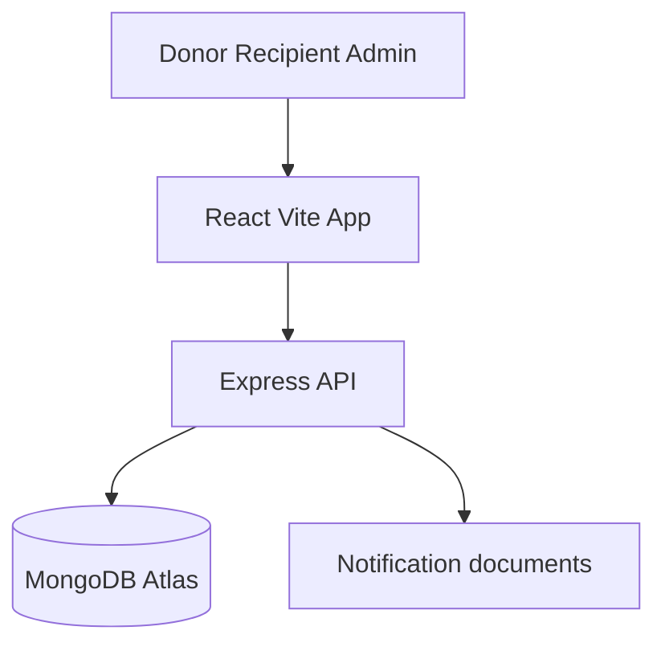
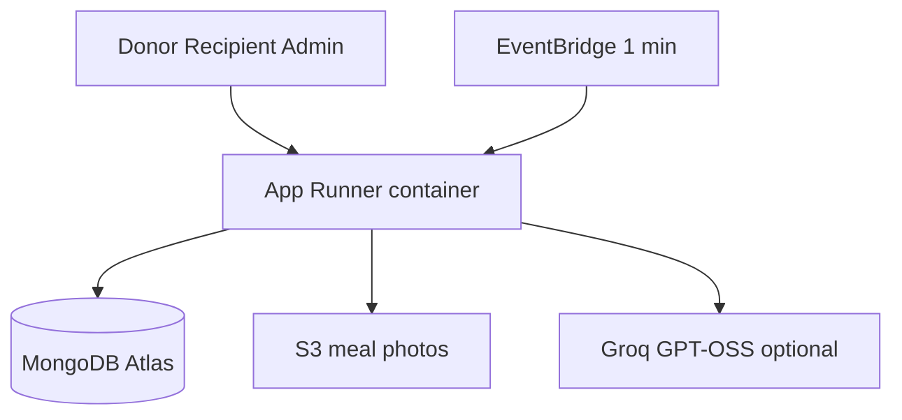

# ShareTable

Don't waste food. Rescue it.

ShareTable connects people and businesses with surplus food to registered recipients nearby (NGOs, community groups, and individual community members). Matching is limited to about **2.5 km** at first, and each listing has a **1-hour** claim window.

This is a working product demo, not a chatbot-only experiment and not a food-waste blog. Donors type how much food they have. The app matches on registration and distance. It never ranks people by need.

## Live demo

- App and API: [https://vmcwfgh43e.ap-south-1.awsapprunner.com](https://vmcwfgh43e.ap-south-1.awsapprunner.com)
- Health check: [https://vmcwfgh43e.ap-south-1.awsapprunner.com/api/health](https://vmcwfgh43e.ap-south-1.awsapprunner.com/api/health)

The live service runs on **AWS App Runner** in `ap-south-1` (Express API and Vite frontend in one container), with **MongoDB Atlas** for data and **S3** for meal photos. CloudFront is optional and may stay off until the AWS account finishes verification. Use the App Runner HTTPS URL for demos.

Try the seeded accounts under [Demo credentials](#demo-credentials).

## Problem

College messes, restaurants, events, and households often have leftover food that is still usable. It gets thrown away because there is no fast way to tell nearby registered recipients it is available.

## Solution

**DONATE → MATCH (2.5 km) → NOTIFY → CLAIM (atomic) → PICKUP CODE → PICKED UP → IMPACT**

Only meals marked **PICKED_UP** count as rescued. Unclaimed meals after expiry do not.

## What you can do today

### Core rescue flow

- Email and password auth with JWT, plus donor, recipient, and admin roles
- Email verification over SMTP before first login (Gmail App Password supported)
- Donor posts surplus meals with quantity, optional photo, allergens, and custom prepared / best-before times
- Geospatial matching on MongoDB Atlas (`2dsphere` / `$geoNear`) at `DEFAULT_RADIUS_KM=2.5`
- Atomic claims that never drive `availableQuantity` negative
- Clear concurrent-claim message when someone else takes meals first
- One-hour server-side expiry (the countdown on screen is informational)
- Pickup codes like `ST-1234`
- Donor, recipient, and admin impact dashboards

### Maps and places

- Leaflet maps with Esri street tiles (clean look, no Leaflet attribution clutter)
- Location picker with GPS, named area search, and pins that sit correctly under the sticky nav
- Recipients see distance until they claim; exact pickup details unlock after a claim
- Admin heatmap snaps live markers to a ~200 m grid for privacy

### Donate experience

- Empty-state donate wizard with optional pickup instructions
- **Improve description with AI** (Groq open-weight model by default; Bedrock Nova when enabled)
- Common allergen checklist plus custom allergens, with a quick remove control
- Custom datetime picker with 12-hour AM/PM and guardrails so times stay sensible
- Horizontal card lists and accent titles for a calmer browse UI

### Claims and live status

- Claim button shows a loader while the request is in flight
- Donation and claim detail pages refresh about every **8 seconds** so pickup status stays current
- In-app notifications also poll about every **8 seconds**

### ShareTable Assistant

A floating assistant for donors and recipients (not shown to admins). It can explain pickup rules, check an open pickup, and propose updates. Nothing is sent until you confirm.

Supported update types:

- **Late** (running behind or a clock-time ETA)
- **Pickup instructions** (for example food kept with the guard)
- **Arrived** (pure arrival at the door or location)
- **Relay** (short notes either way, such as “please come to the gate”)

Confirm with the **Confirm** button, or by typing short phrases like `send it`, `send the notification`, `yes`, or `confirm`. Cancel with the button or phrases like `cancel` / `never mind`.

Arrival wording such as “I have reached the location, please come to the gate” creates a pending relay. Follow-up “send it” sends that pending update instead of refusing as an unrelated message. Soft donor asks (“ask her to message when she reaches…”) stay relays; they do not invent guard-style instruction copy. Pickup codes are stripped from outbound assistant messages where required.

Intelligence elsewhere stays deterministic: MongoDB aggregations produce the numbers. Optional LLM may only rephrase a grounded sentence. If the LLM is down, scores, insights, and dashboards still work.

### Rescue escalation

Unclaimed food can expand from **2.5 km → 4 km → 6 km** after **20 and 40 minutes** (or **30s / 60s** when `DEMO_MODE=true`). Escalation runs after expire-on-read and before any geo query. Nearby lists and claims use `currentRadiusKm`.

On App Runner, EventBridge can call `/api/internal/rescue-tick` once a minute so radius widens even when nobody is clicking around. Locally, without that tick, escalation still evaluates on relevant API reads (nearby, detail, claim, rescue-status).

`POST /api/donations/:id/demo-escalate` exists only when `DEMO_MODE=true` (donor or admin).

### Urgency (no LLM)

```
timeUrgency       = (1 - minutesLeft/60) * 60
escalationUrgency = (level-1) * 20
quantityUrgency   = (available/quantity) * 20
score = clamp(0, 100)
```

Time remaining dominates. Cards show **NORMAL RESCUE / RESCUE EXPANDED / URGENT RESCUE** as text, not color alone.

### Donor waste intelligence

```
donated  = SUM(Donation.quantity)
claimed  = SUM(Claim.quantity)
rescued  = SUM(Claim.quantity WHERE status = PICKED_UP)
```

Example: 40 donated, 10 claimed, 7 picked up, 3 cancelled or no-show, 30 never claimed → rescued = **7**, not 10.

Average pickup time uses `(pickedUpAt - claimedAt)` only for `PICKED_UP` claims. Claim `quantity` is immutable after creation. Donors also get a surplus **Insights** view built from pattern observations (seeded Polaris history is labeled **Demo Data**).

### Operational reliability

Computed from claims, never stored on `User`:

```
score = 0.4*successfulPickupRate + 0.3*onTimeRate
      + 0.2*(1-cancellationRate) + 0.1*(1-noShowRate)
```

On-time means `PICKED_UP` with `pickedUpAt <= pickupDeadline` (falls back to `completedAt` if needed). This is operational reliability, not a ranking, and it never hides a recipient.

### Admin tools

- User list filters: All / Verified / Unverified
- Live and historical rescue map with privacy snapping
- Escalation conversion and platform impact stats

## Architecture

Local (supported for development):



Live demo (what is deployed today):



## Tech stack

- React + Vite + TypeScript + Tailwind CSS
- Node.js Express + Mongoose
- MongoDB Atlas (GeoJSON `Point`)
- JWT + bcrypt
- Leaflet + Esri World Street Map tiles
- Optional LLM: Groq `openai/gpt-oss-20b` now, Amazon Bedrock Nova Micro later (`LLM_PROVIDER=bedrock`)
- AWS App Runner for the live demo; S3 for photos; EventBridge for rescue ticks

## Database schema

- **User**: role, org, GeoJSON `location`, `isVerified`, email verification fields
- **Donation**: food details, `quantity`, `availableQuantity`, times, allergens, GeoJSON `location`, status, `escalationLevel`, `currentRadiusKm`, `notifiedRecipients`
- **Claim**: immutable `quantity`, `claimCode`, `pickedUpAt`, pickup status
- **Notification**: in-app message for a user

Donation statuses: `ACTIVE` → `PARTIALLY_CLAIMED` / `FULLY_CLAIMED` → `COMPLETED`, or `EXPIRED` if leftover meals remain after one hour.

## API

| Method | Path | Purpose |
| --- | --- | --- |
| POST | `/api/auth/register` | Register donor or recipient |
| POST | `/api/auth/login` | Login |
| GET | `/api/auth/me` | Current user |
| POST | `/api/auth/verify-email` | Confirm email from link token |
| POST | `/api/donations` | Create donation + notify nearby recipients |
| GET | `/api/donations/nearby` | Recipient nearby list |
| GET | `/api/donations/:id` | Donation details |
| POST | `/api/donations/:id/claim` | Atomic claim |
| GET | `/api/claims` | Claims for current user |
| PATCH | `/api/claims/:id` | Mark picked up |
| GET | `/api/notifications` | In-app notifications |
| GET | `/api/dashboard/donor` | Donor stats |
| GET | `/api/dashboard/recipient` | Recipient stats |
| GET | `/api/dashboard/admin` | Platform impact |
| GET | `/api/donations/:id/rescue-status` | Escalation + urgency |
| POST | `/api/donations/:id/demo-escalate` | DEMO_MODE only |
| GET | `/api/donor/analytics` | Donor waste intelligence |
| GET | `/api/donor/patterns` | Surplus pattern observations |
| GET | `/api/recipients/:id/reliability` | Operational reliability |
| GET | `/api/admin/heatmap` | Snapped live/historical map |
| GET | `/api/admin/rescue-activity` | Escalation conversion stats |
| GET | `/api/places/search` | Named place / area search for maps |
| POST | `/api/ai/describe-food` | Optional LLM food description helper |
| POST | `/api/assistant` | Assistant turn (may return `pendingActionId`) |
| POST | `/api/assistant/confirm` | Confirm and send a pending update |
| POST | `/api/assistant/cancel` | Cancel a pending update |
| POST | `/api/uploads/presign` | Optional S3 photo upload |
| POST | `/api/internal/rescue-tick` | EventBridge rescue escalation tick |
| GET | `/api/health` | Runtime, region, LLM health |
| GET | `/api/impact` | Public impact snapshot |

## Local setup

1. Install Node.js 20+.
2. Copy environment variables:

```bash
cp .env.example .env
```

3. Set `DATABASE_URL` to a MongoDB Atlas URI (or start local MongoDB with `docker compose up -d`).
4. Set `JWT_SECRET` to a long random string.
5. For AI helpers and the assistant rephrase path, set `LLM_PROVIDER=groq` and `GROQ_API_KEY` (create a key at [console.groq.com](https://console.groq.com)).
6. Optional: set SMTP vars if you want real verification emails locally.
7. Install and run:

```bash
npm install
npm run seed
npm run dev
```

- App: http://localhost:5173
- API: http://localhost:3001/api/health

Leave `VITE_API_URL` unset in local `npm run dev` so the Vite `/api` proxy talks to port 3001.

## Environment variables

See [`.env.example`](.env.example):

- `DATABASE_URL`: MongoDB connection
- `JWT_SECRET`: signing secret
- `DEFAULT_RADIUS_KM`: default `2.5`
- `RESCUE_RADIUS_LEVELS`: default `2.5,4,6`
- `ESCALATION_MINUTES`: default `20,40`
- `DEMO_MODE`: `true` uses 30s/60s thresholds and enables demo-escalate
- `PATTERN_MIN_DONATIONS`: default `5`
- `AWS_REGION`, `S3_BUCKET`, `PHOTO_CLOUDFRONT_URL`: optional photo hosting
- `LLM_PROVIDER`: `groq` now; flip to `bedrock` after AWS verification
- `GROQ_API_KEY`, `GROQ_MODEL`: Groq open-weight fallback (`openai/gpt-oss-20b`; Llama 3.1 8B Instant was retired on the free tier)
- `BEDROCK_MODEL_ID`: keep `amazon.nova-micro-v1:0` for the later flip
- `INTERNAL_TICK_SECRET`: shared secret for `/api/internal/rescue-tick`
- `RUNTIME`: `local` or `ap-runner`
- `SMTP_HOST`, `SMTP_PORT`, `SMTP_USER`, `SMTP_PASS`, `MAIL_FROM`: email verification
- `VITE_API_URL`: set only for production frontend builds that call a separate API origin

Never commit `.env`.

## Demo credentials

| Role | Email | Password |
| --- | --- | --- |
| Donor (Polaris College Mess) | `pratykshgupta9999@gmail.com` | `Demo@123` |
| Recipient (Helping Hands NGO) | `helpinghands@foodrescue.demo` | `Demo@123` |
| Admin | `admin.sharedtable@gmail.com` | `Demo@123` |

Seeded recipients around the Polaris campus pin in Bengaluru:

- Helping Hands NGO ~1.1 km: included
- Food For All ~1.8 km: included
- Community Care ~2.3 km: included
- Distant Aid ~3.8 km: excluded from 2.5 km matching, included at level 2
- Outer Reach Kitchen ~5.2 km: included at level 3

## 3-minute demo

With `DEMO_MODE=true` (or use **Expand rescue radius (demo)** on a donation):

1. Donor posts 40 meals → 3 recipients at 2.5 km.
2. Recipient sees 40 meals / ~59 min / **NORMAL RESCUE**.
3. Demo-escalate → 4 km, Distant Aid notified, **RESCUE EXPANDED**.
4. Claim 10 → 30 remain.
5. Pickup → 10 rescued.
6. Donor intelligence: Friday evening pattern from **seeded history**, labeled Demo Data.
7. Optional: open the Assistant, say you reached the location and ask the donor to come to the gate, then type `send it`.
8. Admin map: Urgent / Active / Rescued plus escalation conversion.

We do not predict imaginary demand. We learn from actual rescue history and real-time operational signals.

## Tests

```bash
npm test
```

Covers auth, geo include/exclude, over-claim UX, concurrent claims, expiry, rescued = picked up only, escalation, urgency, analytics, patterns, reliability, heatmap privacy, and assistant propose/confirm flows (including reached + gate and typed `send it`).

## Deployment

### Live path (preferred for demos)

App Runner builds from the repo-root `Dockerfile` (0.25 vCPU / 0.5 GB). Set the App Runner env vars listed in [`infrastructure/README.md`](infrastructure/README.md). Point `CLIENT_ORIGIN` at the App Runner URL. Keep `LLM_PROVIDER=groq` until Bedrock is verified on the account.

Current URL: [https://vmcwfgh43e.ap-south-1.awsapprunner.com](https://vmcwfgh43e.ap-south-1.awsapprunner.com)

### Older SAM / Lambda path (optional)

1. `cd server && npm run build`
2. `sam build -t infrastructure/template.yaml`
3. `sam deploy --guided` (pass `DatabaseUrl` and `JwtSecret`)
4. Build the client with `VITE_API_URL` pointing at the API Gateway URL, then upload `client/dist` to S3.

The Express app also has a Lambda entry in [`server/src/lambda.ts`](server/src/lambda.ts) via `serverless-http`. Prefer App Runner for the Ship It demo.

## Food safety

Donors are responsible for ensuring that donated food is safe, properly handled, and suitable for consumption. ShareTable only facilitates discovery, claiming, and pickup. The product does not invent food-safety guarantees in AI or assistant copy.

## Future improvements

- Email and push notifications beyond in-app polling
- Stronger NGO verification (still not KYC-by-poverty)
- CloudFront in front of the static assets and photos after AWS verification
- Persist assistant pending actions beyond the in-memory process store
- Flip `LLM_PROVIDER` to Bedrock Nova once the account allows it
