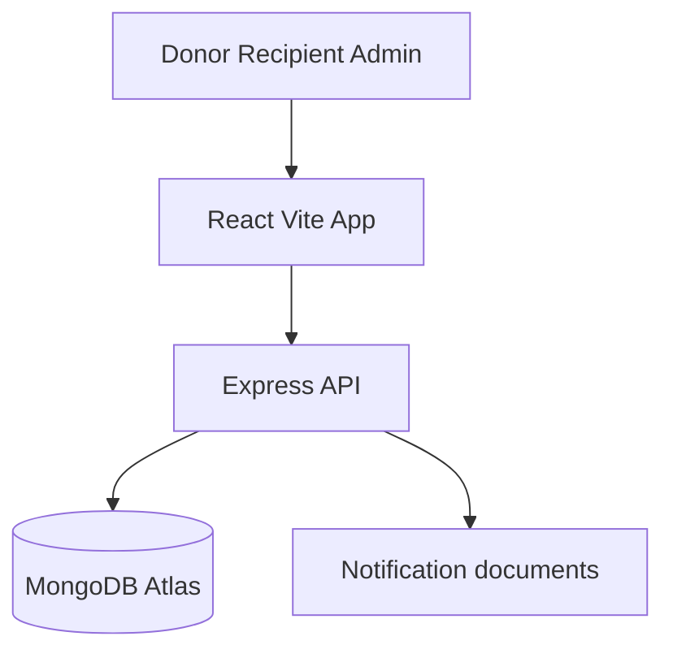
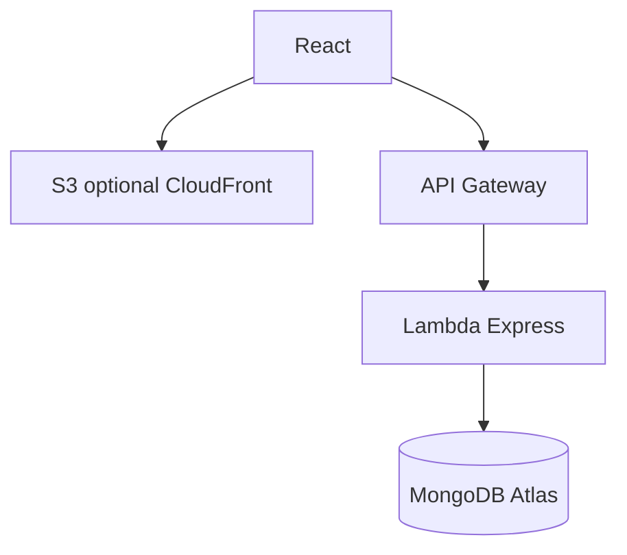

# ShareTable

Don't waste food. Rescue it.

ShareTable is a hackathon MVP that connects people and businesses with surplus food to **registered recipients nearby** (NGOs, community organizations, and individual community members) within about **2.5 km**, with a **1-hour** claim window.

The product is not a chatbot, not a food-waste article site, and does not predict how many meals exist. The donor types the surplus quantity. Matching is registration + distance, never a judgment of need.

## Problem

College messes, restaurants, events, and households often have leftover food that is still usable. It is thrown away because there is no fast way to tell nearby registered recipients it is available.

## Solution

**DONATE → MATCH (2.5 km) → NOTIFY → CLAIM (atomic) → PICKUP CODE → PICKED UP → IMPACT**

Only meals marked **PICKED_UP** count as rescued. Unclaimed meals after expiry are not rescued.

## Features

- Email/password JWT auth with donor, recipient, and admin roles
- Donor posts surplus meals (manual quantity, safety confirmation)
- MongoDB Atlas geospatial matching (`2dsphere` / `$geoNear`) at `DEFAULT_RADIUS_KM=2.5`
- In-app notifications (poll every 20 seconds)
- Atomic claims that never drive `availableQuantity` negative
- Concurrent-claim error: *Only N meals remain. Another recipient claimed some meals just before you.*
- 1-hour server-side expiration (frontend countdown is informational)
- Pickup codes (`ST-1234`)
- Donor, recipient, and admin impact dashboards
- Leaflet + OpenStreetMap map
- Optional Amazon Bedrock food-description helper

## Advanced features

Intelligence stays deterministic. MongoDB aggregations produce the numbers. Optional Bedrock may only rephrase a pattern sentence. If Bedrock is down, scores, insights, and dashboards still work.

### Rescue escalation

Unclaimed food can expand from **2.5 km → 4 km → 6 km** after **20 and 40 minutes** (or **30s / 60s** when `DEMO_MODE=true`). Escalation runs **after expire-on-read and before any geo query**. Nearby lists and claims use `currentRadiusKm`, so Distant Aid (~3.8 km) can claim at level 2 and Outer Reach Kitchen (~5.2 km) at level 3.

**Limitation (this MVP):** there is no background scheduler. Escalation is evaluated when a relevant API is hit (nearby, donation detail, claim, rescue-status). If nobody reads a donation for 7 minutes after the 20-minute mark, it stays at level 1 until the next read. Production can later move this to EventBridge or a queue.

`POST /api/donations/:id/demo-escalate` exists only when `DEMO_MODE=true` (donor or admin).

### Urgency (no LLM)

```
timeUrgency       = (1 - minutesLeft/60) * 60
escalationUrgency = (level-1) * 20
quantityUrgency   = (available/quantity) * 20
score = clamp(0, 100)
```

Time remaining is dominant. Cards show **NORMAL RESCUE / RESCUE EXPANDED / URGENT RESCUE** as text, not color-only.

### Donor waste intelligence

```
donated  = SUM(Donation.quantity)
claimed  = SUM(Claim.quantity)
rescued  = SUM(Claim.quantity WHERE status = PICKED_UP)
```

Example: 40 donated, 10 claimed, 7 picked up, 3 cancelled/no-show, 30 never claimed → rescued = **7**, not 10.

Average pickup time = average of `(pickedUpAt - claimedAt)` **only** for `PICKED_UP` claims. Claim `quantity` is immutable after creation.

### Surplus patterns

A pattern is shown only when a bucket is clearly above that donor's own average (for example Friday >= 1.5x other days and >= 5 Friday donations). Copy is observational: "A recurring pattern was detected in your recent donation history." Never "this will definitely happen." Seeded Polaris history is labeled **Demo Data**.

### Operational reliability

Computed from claims, never stored on `User`:

```
score = 0.4*successfulPickupRate + 0.3*onTimeRate
      + 0.2*(1-cancellationRate) + 0.1*(1-noShowRate)
```

On-time = `PICKED_UP` with `pickedUpAt <= pickupDeadline` (falls back to `completedAt` if `pickedUpAt` is missing). This is **operational reliability**, not a ranking, and never hides a recipient.

### Heatmap privacy

Admin live markers are snapped to a ~200 m grid. Historical cells expose area id, counts, meals, and average rescue time: **no addresses, no user ids, no exact coordinates**. Recipients see **distance**, not pickup coordinates, until they have a claim. Donors see claimant org name + reliability score, not private coordinates.

## Architecture

Local (this is the supported hackathon path):



AWS later (optional, after the local demo works):



## Tech stack

- React + Vite + TypeScript + Tailwind CSS
- Node.js Express + Mongoose
- MongoDB Atlas (GeoJSON `Point`)
- JWT + bcrypt
- Leaflet / OpenStreetMap
- Optional: AWS Lambda, API Gateway, S3, Amazon Bedrock

## Database schema

- **User**: role, org, GeoJSON `location`, `isVerified`
- **Donation**: food details, `quantity`, `availableQuantity`, `createdAt`, `expiresAt`, GeoJSON `location`, status, `escalationLevel`, `currentRadiusKm`, `notifiedRecipients`
- **Claim**: immutable `quantity`, `claimCode`, `pickedUpAt`, pickup status
- **Notification**: in-app message for a user

Donation statuses: `ACTIVE` → `PARTIALLY_CLAIMED` / `FULLY_CLAIMED` → `COMPLETED`, or `EXPIRED` if leftover meals remain after one hour.

## API

| Method | Path | Purpose |
| --- | --- | --- |
| POST | `/api/auth/register` | Register donor or recipient |
| POST | `/api/auth/login` | Login |
| GET | `/api/auth/me` | Current user |
| POST | `/api/donations` | Create donation + notify nearby recipients |
| GET | `/api/donations/nearby` | Recipient nearby list |
| GET | `/api/donations/:id` | Donation details |
| POST | `/api/donations/:id/claim` | Atomic claim |
| GET | `/api/claims` | Claims for current user |
| PATCH | `/api/claims/:id` | Mark picked up |
| GET | `/api/notifications` | In-app notifications |
| GET | `/api/dashboard/donor` | Donor stats |
| GET | `/api/dashboard/recipient` | Recipient stats |
| GET | `/api/dashboard/admin` | Platform impact |
| GET | `/api/donations/:id/rescue-status` | Escalation + urgency |
| POST | `/api/donations/:id/demo-escalate` | DEMO_MODE only |
| GET | `/api/donor/analytics` | Donor waste intelligence |
| GET | `/api/donor/patterns` | Surplus pattern observations |
| GET | `/api/recipients/:id/reliability` | Operational reliability |
| GET | `/api/admin/heatmap` | Snapped live/historical map |
| GET | `/api/admin/rescue-activity` | Escalation conversion stats |
| POST | `/api/ai/describe-food` | Optional Bedrock helper |

## Local setup

1. Install Node.js 20+.
2. Copy environment variables:

```bash
cp .env.example .env
```

3. Set `DATABASE_URL` to a MongoDB Atlas URI (or start local MongoDB with `docker compose up -d`).
4. Set `JWT_SECRET` to a long random string.
5. Install and run:

```bash
npm install
npm run seed
npm run dev
```

- App: http://localhost:5173
- API: http://localhost:3001/api/health

## Environment variables

See [`.env.example`](.env.example):

- `DATABASE_URL`: MongoDB connection
- `JWT_SECRET`: signing secret
- `DEFAULT_RADIUS_KM`: default `2.5`
- `RESCUE_RADIUS_LEVELS`: default `2.5,4,6`
- `ESCALATION_MINUTES`: default `20,40`
- `DEMO_MODE`: `true` uses 30s/60s thresholds and enables demo-escalate
- `PATTERN_MIN_DONATIONS`: default `5`
- `AWS_REGION`, `S3_BUCKET`, `BEDROCK_MODEL_ID`: optional

Never commit `.env`.

## Demo credentials

| Role | Email | Password |
| --- | --- | --- |
| Donor (Polaris College Mess) | `pratykshgupta9999@gmail.com` | `Demo@123` |
| Recipient (Helping Hands NGO) | `helpinghands@foodrescue.demo` | `Demo@123` |
| Admin | `admin.sharedtable@gmail.com` | `Demo@123` |

Seeded recipients around the Polaris campus pin in Bengaluru:

- Helping Hands NGO ~1.1 km: included
- Food For All ~1.8 km: included
- Community Care ~2.3 km: included
- Distant Aid ~3.8 km: excluded from 2.5 km matching, included at level 2
- Outer Reach Kitchen ~5.2 km: included at level 3

## 3-minute demo

With `DEMO_MODE=true` (or use **Expand rescue radius (demo)** on a donation):

1. Donor posts 40 meals → 3 recipients at 2.5 km.
2. Recipient sees 40 meals / ~59 min / **NORMAL RESCUE**.
3. Demo-escalate → 4 km, Distant Aid notified, **RESCUE EXPANDED**.
4. Claim 10 → 30 remain.
5. Pickup → 10 rescued.
6. Donor intelligence: Friday evening pattern from **seeded history**, labeled Demo Data.
7. Admin map: Urgent / Active / Rescued plus escalation conversion.

We do not predict imaginary demand. We learn from actual rescue history and real-time operational signals.

## Tests

```bash
npm test
```

Covers auth, geo include/exclude, over-claim UX, concurrent claims, expiry, rescued = picked up only, escalation, urgency, analytics identities, patterns, reliability, and heatmap privacy.

## Deployment

Do this **after** the local demo works. Do not spend hackathon time fighting CloudFront first.

1. `cd server && npm run build`
2. `sam build -t infrastructure/template.yaml`
3. `sam deploy --guided` (pass `DatabaseUrl` and `JwtSecret`)
4. Build the client with `VITE_API_URL` pointing at the API Gateway URL, then upload `client/dist` to S3. CloudFront is optional.

The Express app is wrapped in [`server/src/lambda.ts`](server/src/lambda.ts) with `serverless-http`.

## Food safety

Donors are responsible for ensuring that donated food is safe, properly handled, and suitable for consumption. ShareTable only facilitates discovery, claiming, and pickup.

## Future improvements

- Email / push notifications
- EventBridge expiry scheduler
- Presigned S3 image uploads
- CloudFront CDN
- Stronger NGO verification (still not KYC-by-poverty)
