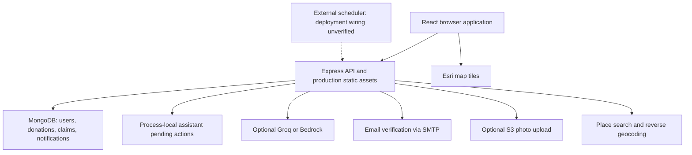

# ShareTable: project context and review

Reviewed 20 September 2026 against commit `6f02b7326ce01715dfeddf1e2dbb8f7cffe1a713`.

This document combines the attached Cursor planning text, current repository, local verification, and official platform documentation. The attachment contains the original specification and early planning; it is not a complete record of later implementation decisions. Current code and explicit subsequent user decisions take precedence over that older brief. No application behavior was changed during this review.

## Product and non-negotiable rules

ShareTable connects food donors with nearby recipients. Its core flow is: publish a donation, notify nearby recipients, reserve a quantity, collect using a pickup code, then count the collected quantity as rescued.

- Donors supply quantities. AI must not invent quantities or food-safety guarantees.
- A reservation is not a rescue. Only `PICKED_UP` claims contribute rescued meals.
- Partial collection followed by expiry leaves a donation expired when food remains unclaimed; it must not imply that everything was rescued.
- Access depends on authenticated role and record ownership. Exact pickup information is restricted before a claim.
- The assistant can propose `LATE`, `UPDATE_INSTRUCTIONS`, `ARRIVED`, and `RELAY` updates. Outbound updates require explicit confirmation.
- Pickup codes must not appear in donor cancellation alerts.
- NGO verification and recipient reliability should not silently become judgments about need or poverty.

Example: a 40-meal donation with a 10-meal reservation still has zero rescued meals. After those 10 are collected, it has 10 rescued meals and 30 available meals. Other reservations, cancellations, expiry, and administrative changes must preserve this accounting.

## Current architecture

The project is an npm-workspace monorepo. The client uses React 19, TypeScript, Vite 8, Tailwind 4, React Router, Leaflet, and Recharts. The server uses Express 5, TypeScript, Mongoose 9, Zod, JWT, and bcrypt.

The production Docker image uses Node 22 and serves the API and built frontend together on App Runner. Local development uses Vite on 5173 and the API on 3001. MongoDB Atlas is the documented production database; local Docker uses MongoDB. The repository also retains an earlier SAM/Lambda deployment template, which should not be mistaken for a complete description of the App Runner deployment.

| Area | Main implementation |
| --- | --- |
| Server startup, middleware, configuration | `server/src/app.ts`, `server/src/config.ts` |
| Persistence | `server/src/models/` |
| Listing creation and nearby matching | `server/src/services/listings.ts`, `geo.ts` |
| Reservation, collection, cancellation | `server/src/services/claims.ts` |
| Administrative changes | `server/src/services/admin.ts` |
| Impact and donor analysis | `server/src/services/dashboard.ts`, `analytics.ts`, `patterns.ts` |
| Assistant detection, classification, action execution | `server/src/assistant/` |
| Provider selection | `server/src/services/llm.ts`, `groq.ts`, `bedrock.ts` |
| Assistant interface | `client/src/components/AssistantPanel.tsx` |
| Existing conversation coverage and expectations | `docs/assistant-conversations.md`, `server/src/tests/assistant.test.ts` |

## Important implemented behavior

**Accounts:** Registration supports donors and recipients. Login requires email verification. NGO verification is a separate administrator-managed flag. Authentication rechecks the database user, including flagged status and role. Admin routes are role protected. JWTs last seven days. Without a working verification-email path, ordinary registration cannot complete the login journey even though some local documentation describes SMTP as optional.

**Discovery:** GeoJSON coordinates are longitude then latitude. Listings start with a 2.5 km radius and can escalate to 4 km and 6 km after 20 and 40 minutes; demo timings are shorter. Listings expire after one hour. Notifications are persisted in MongoDB and polled by the client. Several read paths also trigger expiry/escalation work.

**Claims:** An atomic conditional decrement prevents two requests from directly taking more than the available quantity in that single update. Claim creation, status changes, and notifications happen separately afterward. This distinction is the source of important failure gaps below.

**Collection:** Only the owning donor or an administrator can complete pickup using the code. Recipients cannot complete their own pickup. Donors normally do not see the code before collection; administrators can see it in administrative detail views.

**Assistant:** English keyword handling supports arrival/gate requests, typos, delay clarification, follow-ups, target selection, corrections, cancellation, and typed confirmation. Arrival plus an ask to come to the gate becomes a pending relay; pure arrival becomes an arrival proposal. “Send it” confirms an existing pending action. “Notify him” remains a request to propose/reuse an instruction, rather than implicit permission to execute. LLM output does not itself authorize a notification. This is application logic and regression coverage, not model fine-tuning or a guarantee of handling every conversation.

**Providers:** Configuration selects Groq, Bedrock, or no LLM. Callers implement deterministic fallback; there is no automatic switch to the other provider. The configured Groq model is `openai/gpt-oss-20b`. This matches Groq's documented replacement for the retired free/developer-tier `llama-3.1-8b-instant` model. [Groq deprecations](https://console.groq.com/docs/deprecations)

**Privacy:** General listing serialization hides exact location, address, and instructions until a claim exists; maps use approximate coordinates. Existing past/cancelled claims still affect this access decision, so post-cancellation visibility needs an explicit product policy.

## Verification performed

- Existing test suite: **179 tests passed across six files**.
- Production build: server TypeScript and client TypeScript/Vite passed. Vite warned about a large JavaScript chunk, approximately 943 kB before gzip.
- Five temporary diagnostic tests ran against an isolated MongoDB memory server and confirmed the observations below. They did not touch production data. These tests asserted existing defects for investigation and were removed afterward, rather than added as accepted behavior to the normal suite.
- A read-only request to the documented public `/api/health` endpoint returned HTTP 200 with `runtime: ap-runner`, region `ap-south-1`, `demoMode: false`, and Groq configured. Its `llm.ok` was false. That flag indicates a successful provider call within a recent process-local window; it does not by itself establish a provider outage. The health route does not validate the database or prove which Git commit is deployed.
- No production mutations, browser end-to-end tests, live provider calls, email deliveries, S3 uploads, or AWS-account/IAM inspections were performed.

## Reproduced findings

| Priority | Observation and reproduction | Implication |
| --- | --- | --- |
| P0 | Start with 40 meals; reserve 10; force the next generated pickup code to collide with the first; attempt a reservation for 5. Claim insertion fails with duplicate-key error, but availability becomes 25 and only the original 10-meal claim exists. | Five meals disappear from accounting. The inventory decrement and claim insertion need one recoverable operation. |
| P0 | Reserve 10 of 40; mark that claim `NO_SHOW` through the admin service; reserve and collect all restored 40; then complete the original no-show claim using its valid code. | Rescued meals become **50 from a donation of 40**. Pickup rejects cancelled claims but does not reject no-show claims. |
| P1 | Submit two simultaneous 5-meal reservations by the same recipient against one listing. Both succeeded in the isolated reproduction. | The existing check for an open claim races; a database-level invariant is missing. |
| P1 | Change an open claim quantity from 10 to 15 through the admin service. The stored quantity changes despite the model marking it immutable. | Administrative behavior contradicts the immutable-reservation contract. This was an authorized service-path test, not an admin authorization bypass. |
| P1 | Call the donation-time validator with only one timestamp. A malformed prepared timestamp or a historical best-before timestamp returns no validation error from the helper. | Validation depends on supplying both values. A malformed value may still fail downstream casting; this test does not claim that malformed dates persist. |

Relevant code: `services/claims.ts` checks for an open claim around line 61, decrements around line 72, and creates the claim around line 105. `completePickup` begins around line 139. Administrative restoration and editing are in `services/admin.ts`, including raw collection quantity updates around line 389. Timestamp validation is in `utils/donationTimes.ts`.

Pickup codes have only 9,000 possible four-digit suffixes and a globally unique index, with no collision retry in the reservation path. Duplicate-key errors are also mapped generically to an email-account conflict, producing misleading errors for this case.

MongoDB guarantees atomicity for a single-document update, not for the separate donation and claim writes used here. A transaction or an explicitly recoverable reservation design is needed, with database-enforced uniqueness and safe retries. Transaction-based tests/development would also require a replica-set-capable MongoDB configuration. [MongoDB atomicity documentation](https://www.mongodb.com/docs/manual/core/write-operations-atomicity/)

## Additional findings from source review

These are code observations or risks, not all independently reproduced failures.

### Consistency and lifecycle

- Deleting a recipient through the administrative service deletes open claims without restoring their reserved inventory.
- Expiry handles active/partially claimed listings with available food. Fully reserved listings with pending collection are not automatically resolved as no-shows. Late pickup is currently accepted. The intended deadline and late-collection policy need to be explicit.
- Pickup completion and radius escalation use multi-step reads and writes; concurrent execution can produce duplicate side effects. No durable outbox coordinates database transitions with notification delivery.
- `PICKUP_REMINDER` and `DONATION_EXPIRED` notification types exist, but no producers were found during review.
- Matching does not use NGO verification as a gate. Whether it should is a product decision, not an assumed missing security rule.

### Assistant and operational behavior

- Pending assistant actions and duplicate-execution tracking are process-local, with a ten-minute pending lifetime. Restarting or routing the next request to another instance can lose the proposal. Shared durable storage and atomic confirmation consumption are needed for reliable multi-instance operation. App Runner explicitly expects applications to be stateless and does not guarantee state across requests. [App Runner development guidance](https://docs.aws.amazon.com/apprunner/latest/dg/develop.html)
- Clock-based ETA parsing and formatting use server-local time without an explicit business timezone. The `en-IN` locale does not select the Asia/Kolkata timezone. Pattern grouping also uses server-local date methods while other charts use UTC buckets. Establish a consistent timezone contract.
- Groq and server-side place-search fetches have no explicit timeout. The donor dashboard waits for pattern analysis alongside its main data, so an optional provider can delay the main screen.
- Model grounding is partly prompt enforced. AI description output and analytical numbers need stronger validation where correctness matters.
- Production configuration retains a known development JWT-secret fallback if the environment variable is absent. Production should fail startup without a suitable configured secret. This review did not establish that the live deployment uses the fallback.
- Actual scheduler configuration is unverified. If EventBridge API destinations invoke the tick endpoint, their five-second response timeout and retry behavior make bounded, repeat-safe processing necessary. [EventBridge API destinations](https://docs.aws.amazon.com/eventbridge/latest/userguide/eb-api-destinations.html)

### Metrics, interface, and integration gaps

- `patterns.ts` calculates `weeklyAverage` as average quantity per listing, rather than a weekly total average. Its expired-meal calculation sums full listing quantities, potentially including already collected portions.
- Some escalation statistics count listings at a radius level rather than rescued meals; collection timing does not establish that escalation caused a rescue.
- Recipient reliability includes pending claims in its denominator and can penalize recipients for donor cancellation. These choices need product review.
- Demo provenance is not stored per record. One analytics response always labels data “Demo Data,” while other totals can include seeded records without clearly distinguishing them. Demo and real impact need consistent separation.
- The recipient dashboard fetches nearby listings on mount rather than polling them, despite other views and notifications updating periodically.
- Photo selection/upload components exist, but no integration into the donate form was found. The documented upload route differs from the implemented `/api/uploads/photo-url`. Real S3 read access and CORS remain unverified.
- Esri tiles are used with empty/disabled attribution. Restore the provider and data-source attribution described by Esri. [Esri Leaflet terms](https://github.com/Esri/esri-leaflet#terms)
- Time validation differs between the client and server: the server allows a 36-hour prepared window while its message refers to today; the client is stricter.
- Impact conversion assumptions are code constants rather than fully configurable settings. Preserve their assumption labels.
- No browser end-to-end suite or repository CI workflow was found. Passing backend tests do not establish that the complete donor/recipient browser journey works.

## How the project evolved from the Cursor brief

| Earlier brief | Current position |
| --- | --- |
| Initial Food Rescue branding | ShareTable branding and broader interface implementation |
| Firebase suggested for authentication | JWT/bcrypt with email verification selected and implemented |
| SAM/Lambda/API Gateway deployment | App Runner deployment documented and publicly responding; legacy SAM remains |
| Initial 2.5 km matching | Implemented, with later radius escalation |
| Generic chatbot excluded from initial MVP | Later explicit scope adds a restricted pickup assistant with confirmation |
| Optional food photo | Supporting pieces exist; donate-flow integration incomplete |
| Fully claimed sometimes treated as rescued in early examples | Corrected rule is collected meals only; upstream lifecycle bugs still threaten it |

Do not rebuild the app from the initial brief or remove later authorized features simply because they were absent from that brief.

## Recommended next implementation order

1. Fix accounting and state transitions: reject terminal no-show pickup, make reservation creation recoverable, handle code collisions, enforce one open reservation, and make admin operations preserve inventory. Add permanent regression tests asserting correct outcomes, including concurrent requests and retries.
2. Make assistant proposals durable and confirmation idempotent across instances. Preserve the explicit-confirmation boundary and existing English conversation tests.
3. Decide and implement deadline, no-show, cancellation-privacy, and business-timezone policies. Unify client/server timestamp validation.
4. Bound optional service calls; correct analytics definitions and demo labeling; restore attribution and finish the photo journey if it remains in scope.
5. Add a browser smoke journey covering donor creation, recipient reservation, assistant proposal/confirmation, donor pickup, and resulting impact. Verify actual cloud secrets, IAM, SMTP, S3, scheduling, and deployed revision separately.

## Working constraints retained from the handoff

Do not restart the full development command and disrupt forwarded port 5173. Do not push the fork or commit without being asked. When commits are requested, use focused changes, signoff, one-line subjects, and no Cursor co-author. Respect the stated frontend/backend identities. Preserve unrelated changes. Never run destructive seed/reset commands against the configured live database.

The repository was clean at the start of this review. The only retained change from the review is this document.
